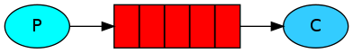

# What is `RabbitMQ` and how to use it in .NET Core?
Everything i will say is nothing but RabbitMQ documentation which i summarize it.  
In part 1 of this series we will learn what is it and how to use it in .NET Core.  
So what is it? `RabbitMQ is a message broker`. In fact you can use `RabbitMQ` in any project but mostly it is using in Microservices, Why? Picture this: you have two services that one is running on server A and another is running on server B, First one registers users and second one send welcome email. A user registers on server A, how you will notify server B about this registration to send welcome email?  
Yes, `RabbitMQ` will do this for us, but how? Server A (Producer) sends a message to a queue on RabbitMQ server and Server B (Consumer) who is subscribed to this queue will know about this message.  
So we noticed about `Producer` who sends `Message` and `Consumer` who waits for receive message and `Queue` that is nothing but a box that lives in RabbitMQ and stores messages.  

Let's write `Hello World!` application using C# :  
We are going to write two applications in C# one stands for `Producer` and another for `Consumer`, Let's call them `Send` and `Receive` for the sake of simplicity. The goal is sending `Hello World!` message from Send application to Receive application, In the image below `P` is Producer and `C` is Consumer and red box is our queue:  


  

At the first place we need to install RabbitMQ server that I use docker:  
`docker run -d  -p 15672:15672 -p 5672:5672 --hostname my-rabbit --name some-rabbit rabbitmq:3-management`  

Now let's create our projects:  
```
dotnet new console --name Send -o Send
dotnet new console --name Receive -o Receive
```
Then add RabbitMQ.Client nuget packe in both projects:  
```
dotnet add package RabbitMQ.Client
```

Open `Send/Program.cs` class and modify like this:  
```
using System;
using RabbitMQ.Client;
using System.Text;

namespace Send
{
    class Program
    {
        public static void Main(string[] args)
        {
            //Create connection to the server:
            var factory = new ConnectionFactory() { HostName = "localhost" };
            using (var connection = factory.CreateConnection())
            {
                using (var channel = connection.CreateModel())
                {

                }
            }
        }
    }
}
```
In this code we created a connection to server. The connection abstracts the socket connection, and takes care of protocol version negotiation and authentication and so on for us. Here we connect to a RabbitMQ node on the local machine - hence the localhost. If we wanted to connect to a node on a different machine we'd simply specify its hostname or IP address here. Next we created a channel.  
Now we need to declare a queue to send, then we will publish a messge to the queue:  

```
using System;
using RabbitMQ.Client;
using System.Text;

namespace Send
{
    class Program
    {
        static void Main(string[] args)
        {
            var factory = new ConnectionFactory() { HostName = "localhost" };
            using (var connection = factory.CreateConnection())
            {
                using (var channel = connection.CreateModel())
                {
                    channel.QueueDeclare(queue: "hello",
                                        durable: false,
                                        exclusive: false,
                                        autoDelete: false,
                                        arguments: null);

                    var message = "Hello World!";
                    var body = Encoding.UTF8.GetBytes(message);

                    channel.BasicPublish(exchange: "",
                                        routingKey: "hello",
                                        basicProperties: null,
                                        body: body);

                    Console.WriteLine(" [x] Sent {0}", message);
                }

                Console.WriteLine(" Press [enter] to exit.");
                Console.ReadLine();
            }
        }
    }
}
```
### Declaring a queue is idempotent, It will only be created if doesn't exist alredy.
The message content is a byte array, so you can encode whatever you like there.  

So Sender application is finished, now let's modify Receiver application:  
## Receiving:
Open `Receive/Program.cs` and modify like this:  

```
using System;
using RabbitMQ.Client;
using RabbitMQ.Client.Events;
using System.Text;

namespace Receive
{
    class Program
    {
        static void Main(string[] args)
        {
            var factory = new ConnectionFactory() { HostName = "localhost" };
            using(var connection = factory.CreateConnection())
            using(var channel = connection.CreateModel())
            {
                channel.QueueDeclare(queue: "hello",
                                    durable: false,
                                    exclusive: false,
                                    autoDelete: false,
                                    arguments: null);

                var consumer = new EventingBasicConsumer(channel);
                consumer.Received += (model, ea) =>
                {
                    var body = ea.Body.ToArray();
                    var message = Encoding.UTF8.GetString(body);
                    Console.WriteLine(" [x] Received {0}", message);
                };
                channel.BasicConsume(queue: "hello",
                                    autoAck: true,
                                    consumer: consumer);

                Console.WriteLine(" Press [enter] to exit.");
                Console.ReadLine();
            }
        }
    }
}

```

As you can see we declare queue here as well, Because we might start the consumer before the publisher, we want to make sure the queue exists before we try to consume messages from it.  
We're about to tell the server to deliver us the messages from the queue. Since it will push us messages asynchronously, we provide a callback. That is what `EventingBasicConsumer.Received` event handler does.  

Now run projects and you will see that it works fine.  
I changed the message to get from user in [source code](https://github.com/A-Programmer/a-programmer.github.io/tree/master/projects/RabbitMQ/01).